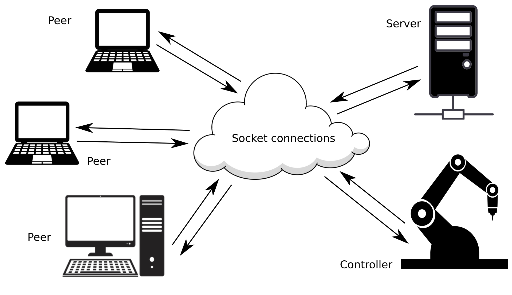

- [What is this library about](#intro)
- [Features](#features)
- [Usage](#usage)
- [Samples](#samples)
- [CMake support](#cmake-support)



## INTRO

**MinimalSocket** gives you a modern **C++** library to set up and create **tcp** and **udp** socket connections, in a
completely platform agnostic way. The supported systems are: **Windows**, any **Linux** distro and **MacOS**.

The [Features](#features) Section details the various features of **MinimalSocket**. Read [Usage](#usage) and [Samples](#samples) to see how easy is to use **MinimalSocket**.

This is a **CMake** project, check [CMake support](#cmake-support) to see how this library can be integrated.

Remember to leave a **star** in case you have found this library useful.

## FEATURES

Haven't left a **star** already? Do it now ;)!

**MinimalSocket** allows you to build and set up **tcp** and **udp** connections. Messages can be sent and received in terms of both buffer of bytes or strings. Indeed, this is actually the only capability you need for a socket, as more complex messages can be serialized into or internalized from a buffer of bytes using, among the others, approaches like [Google Protocol Buffers](https://developers.google.com/protocol-buffers/docs/cpptutorial) or [NanoPb](https://jpa.kapsi.fi/nanopb/).

These are the most notable characteristics of **MinimalSocket**:
- A modern **C++** object oriented API allowing you to set up and build socket connections. Typically, sockets are represented by the classes part of this library. Any time an object is created, the related socket is generated in a closed state in order to defer the opening at the convenient moment. This allows you to decouple the moments when sockets are created from those when the socket should be actually started and used. At the same time, any connection is automatically closed when the handler object is destroyed (and all relevant information cleaned up).
- Prevent you from handling low level socket programming, abstracting from the particular platform hosting your application(s): let **MinimalSocket** do all the work for you. Morevoer, all the system specific modules, functions, linkages (ex. winsock in **Windows**) are not exposed.
- **AF_INET** (**ip v4**) and **AF_INET6** (**ip v6**) addresses, refer to [this](https://www.ibm.com/docs/en/i/7.1?topic=characteristics-socket-address-family) link, are both supported
- For any socket type, **MinimalSocket** allows you to choose between a blocking and a non blocking version (see also the table at the end of this Section as well as the [Usage](#usage) Section). In essence, non blocking sockets functions return always instantaneously, with some kind of result when succeeding or an empty result when failing. On the contrary, blocking sockets absorb the caller till the function can be actually completed. At the same time, it is also possible to specify some timeout for blocking socket after which the completion of the function is considered failed.
- **MinimalSocket** is tested to be **thread safe**. However, notice that for a ceratin socket you can still send while receiving from different threads. This allows you to easily create your own asynchronous sockets, building on top of the classes offered by this library.
- Under **Windows**, [**WSAStartup**](https://docs.microsoft.com/en-us/windows/win32/api/winsock/nf-winsock-wsastartup) is automatically called before using any relevant functionalities. If you need, it is also possible to specify the Windows Sockets to use.

This table summarizes the differences between the blocking and the non blocking behaviours of the socket that can be created using **MinimalSocket**:
| | Blocking Behaviour, caller is blocked till completion or timeout is reached (if one was specified) | Non Blocking Behaviour, functions return immediately |
| --- | --- | --- |
| accepting of a new client (tcp only) | caller thread is absorbed till a new client actually asks to connect or timeout is reached (if any was specified) | if a connection request from a client was already queued before calling the accept function, a new connection handler is returned, otherwise a nullopt is returned. |
| receive a new message (tcp and udp) | caller thread is absorbed till a new a message is sent to the socket or timeout is reached (if any was specified) | if a message was sent and already queued in the socket buffer before calling the receive function, that message is returned, otherwise an empty message is returned. |
| send a new message (tcp and udp) | In case the buffer of the socket is not full and can entirely host the message to send, the message is actaully written in the buffer and the function returns almost instantaneously. On the contrary case, caller thread is absorbed until space is done in the buffer (as messages are consumed from the other side) and after that the message is actually written and function completes. | If there is enough space in the buffer of the socket, the message is written and the function returns. In the contrary case, the function returns immediately without actually send the message (the send can be retried later) |

## USAGE

Haven't left a **star** already? Do it now ;)!

### TCP

#### SERVER

To create a classic blocking **tcp** server you just need to build a **tcp::TcpServer** object:
```cpp
#include <MinimalSocket/tcp/TcpServer.h>

MinimalSocket::Port port = 15768; // the port to bind
MinimalSocket::tcp::TcpServer<true> tcp_server(
    port, MinimalSocket::AddressFamily::IP_V4);
```

open it:
```cpp
// open the server: binds the port and start to listen on the port
bool success = tcp_server.open();
```

and now you are ready to accept new clients:
```cpp
// accepts the next client that will ask the connection
MinimalSocket::tcp::TcpConnectionBlocking accepted_connection =
    tcp_server.acceptNewClient(); // blocking till a client actually asks the
                                // connection
```

you can now exhange messages with the accepted client by simply doing this:
```cpp
// receive a message
std::size_t message_max_size = 1000;
std::string
    received_message // resized to the nunber of bytes actually received
    = accepted_connection.receive(message_max_size);
// send a message
accepted_connection.send("a message to send");
```

If you instead need a non blocking server, you can create it in a similar way:
```cpp
MinimalSocket::Port port = 15768; // the port to bind
MinimalSocket::tcp::TcpServer<false> tcp_server(
    port, MinimalSocket::AddressFamily::IP_V4);
tcp_server.open();
```

This server version will be non blocking, meaning that the accept function will return immediately:
```cpp
// check if a client asked for the connection. If no, the function immediately
// returns a nullopt. On the contrary, the returned optional contains the
// handler to the connected client
std::optional<MinimalSocket::tcp::TcpConnectionBlocking>
    maybe_accepted_connection = tcp_server.acceptNewClient();
```

Notice that even though the server per se is non blocking, the eventually accepted client handler is blocking. 
You can turn it to a non blocking socket too, by transferring the socket to a non blocking handler:
```cpp
MinimalSocket::tcp::TcpConnectionNonBlocking accepted_connection_nn_block =
    maybe_accepted_connection->turnToNonBlocking();
```

#### CLIENT

To create a **tcp** client you just need to build a **tcp::TcpClient** object:
```cpp
#include <MinimalSocket/tcp/TcpClient.h>

MinimalSocket::Port server_port = 15768;
std::string server_address = "192.168.125.85";
MinimalSocket::tcp::TcpClient<true> tcp_client(
    MinimalSocket::Address{server_address, server_port});
```

open it:
```cpp
// Open the server. Here, the client will ask the connection to specified
// server. After that, the client will be actually connected.
bool success =
    tcp_client.open(); // blocking till the connection is actually established
```

you can now receive and send information with the remote server by simply doing this:
```cpp
// send a message
tcp_client.send("a message to send");
// receive a message
std::size_t message_max_size = 1000;
std::string
    received_message // resized to the nunber of bytes actually received
    = tcp_client.receive(message_max_size);
```

If you instead need a non blocking client you can create it ans use it in a similar way:
```cpp
MinimalSocket::Port server_port = 15768;
std::string server_address = "192.168.125.85";
MinimalSocket::tcp::TcpClient<false> tcp_client(
    MinimalSocket::Address{server_address, server_port});
tcp_client.open();

std::size_t message_max_size = 1000;
// non blocking receive: returns immediately with an empty message in case no
// new data were available, or with a non empty message in the contrary case
std::string received_message = tcp_client.receive(message_max_size);
```

### UDP

To create a normal **udp** socket you just need to build a **udp::Udp** object:
```cpp
#include <MinimalSocket/udp/UdpSocket.h>

MinimalSocket::Port this_socket_port = 15768;
MinimalSocket::udp::Udp<true> udp_socket(this_socket_port,
                                        MinimalSocket::AddressFamily::IP_V6);
```

open it:
```cpp
// Open the server. This will bind the specified port.
bool success = udp_socket.open();
```

you can now receive and send information with other **udp** sockets:
```cpp
// send a message to another udp
MinimalSocket::Address other_recipient_udp =
    MinimalSocket::Address{"192.168.125.85", 15768};
udp_socket.sendTo("a message to send", other_recipient_udp);
// receive a message from another udp reaching this one
std::size_t message_max_size = 1000;
auto received_message = udp_socket.receive(message_max_size);
// check the sender address
MinimalSocket::Address other_sender_udp = received_message->sender;
// access the received message
std::string received_message_content // resized to the nunber of bytes
                                    // actually received
    = received_message->received_message;
```

you can also decide to "connect" an opened **udp** socket to a specific address. Beware that this simply means that messages incoming from other peers will be filtered out, as **udp** sockets are not connection oriented:
```cpp
MinimalSocket::Address permanent_sender_udp =
    MinimalSocket::Address{"192.168.125.85", 15768};
MinimalSocket::udp::UdpConnected<true> udp_connected_socket =
    udp_socket.connect(
        permanent_sender_udp); // ownership of the underlying socket is
                                // transfered from udp_socket to
                                // udp_connected_socket, meaning that you can't
                                // use anymore udp_socket (unless you re-open
                                // it)
```

Now you can send and receive data without having to specify the recpient/sender:
```cpp
// receive a message
std::size_t message_max_size = 1000;
std::string
    received_message // resized to the nunber of bytes actually received
    = udp_connected_socket.receive(message_max_size);
// send a message
udp_connected_socket.send("a message to send");
```

You can also create and use non blocking **udp** sockets:
```cpp
MinimalSocket::Port this_socket_port = 15768;
MinimalSocket::udp::Udp<false> udp_socket(
    this_socket_port, MinimalSocket::AddressFamily::IP_V6);
udp_socket.open();

std::size_t message_max_size = 1000;
// non blocking receive: returns immediately with an empty message in case no
// new data were available, or with a non empty message in the contrary case
//
// struct ReceiveStringResult {
//   Address sender;
//   std::string received_message;
// };
std::optional<MinimalSocket::ReceiveStringResult> received_message =
    udp_socket.receive(message_max_size);
```

## SAMPLES

Haven't left a **star** already? Do it now ;)!

Examples of usage about **tcp** sockets can be found [here](./samples/tcp/README.md), while **udp** samples are [here](./samples/udp/README.md) discussed.

ATTENTION!!! The Samples execution might be blocked the first time by your firewall: set up properly your firewall or run the samples with the [administrator privileges](https://www.techopedia.com/definition/4961/administrative-privileges#:~:text=Administrative%20privileges%20are%20the%20ability,as%20a%20database%20management%20system.)

## CMAKE SUPPORT

Haven't left a **star** already? Do it now ;)!
   
In order to consume this library you can rely on [CMake](https://cmake.org).
More precisely, You can fetch this package and link to the **MinimalSocket** library:
```cmake
include(FetchContent)
set(BUILD_MinimalCppSocket_SAMPLES OFF CACHE BOOL "" FORCE) # you don't want the samples in this case
FetchContent_Declare(
min_sock
GIT_REPOSITORY https://github.com/andreacasalino/Minimal-Socket
GIT_TAG        master
)
FetchContent_MakeAvailable(min_sock)
```

and then link to the **MinimalSocket** library:
```cmake
target_link_libraries(${TARGET_NAME}
    MinimalSocket
)
```

All the system specific modules are internally inlcluded and are not exposed.
Moreover, under **Windows**, **wsock32** and **ws2_32** are privately linked and you don't need to link them again when consuming **MinimalSocket**.
